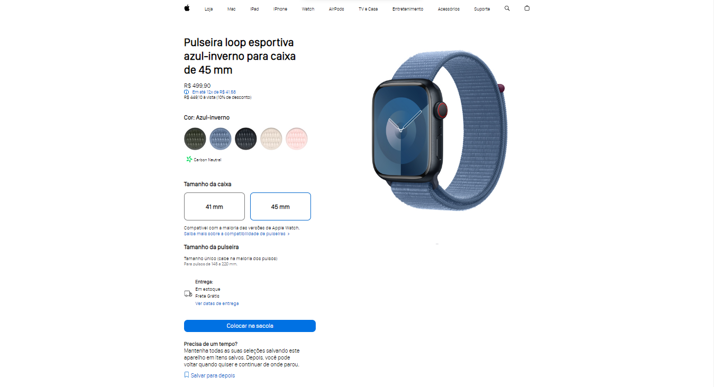

# Intensivão Javascript - Projeto Apple Watch

Esta é a minha versão de um dos projetos do Intensivão Javascript da Hashtag Treinamentos. Os projetos dos intensivões da Hashtag Treinamentos ajudam você a melhorar suas habilidades de codificação através da construção de projetos intuitivos e interessantes. 

## Índice

- [Visão geral](#visão-geral)
   - [O projeto](#o-projeto)
   - [Capturas de tela](#capturas-de-tela)
   - [Links](#links)
- [Meu processo](#meu-processo)
   - [Construído com](#construído-com)
- [Autor](#autor)

## Visão geral

### O projeto

O objetivo desse projeto é simular uma página de compras da Apple que permite aos usuários manipular as opções de cor da pulseira e o tamanho do Apple Watch.

### Capturas de tela

### Links

- Instagram da Hashtag Treinamentos: [Instagram](https://www.instagram.com/hashtagtreinamentos/)

- Youtube da Hashtag Treinamentos: [Youtube](https://www.youtube.com/hashtag-treinamentos)

## Meu processo

### Construído com

- Elementos Semânticos HTML
- Javascript

## Um pouco sobre mim

- Linkedin - [Maria Eduarda da Silva Freitas](www.linkedin.com/in/maria-eduarda-da-silva-freitas-9031aa28a)

# Obrigada por ler! <3
